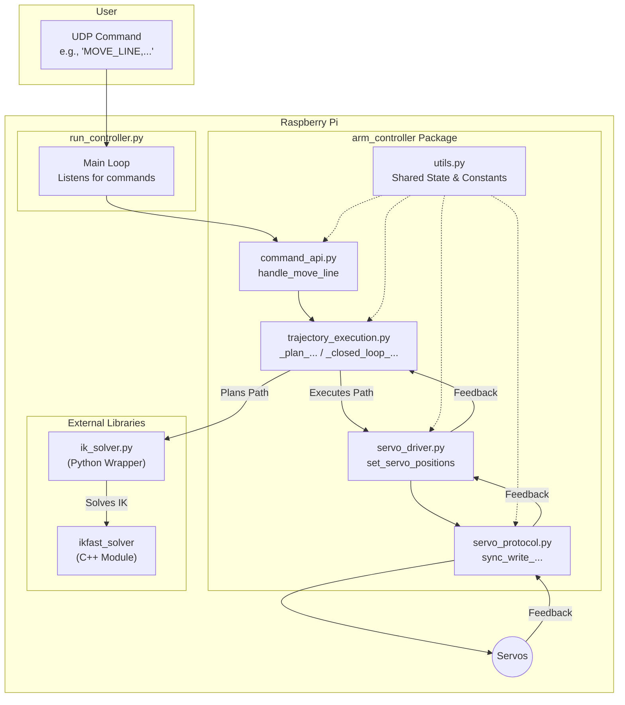
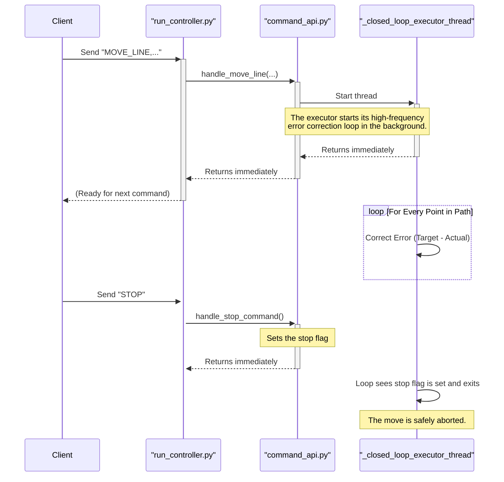

# Mini Arm Controller Documentation

This documentation provides a comprehensive overview of the Mini Arm Controller software, from the high-level API down to the low-level hardware communication and IK solver implementation.

## Documentation Checklist (Detailed)

This checklist tracks the progress of documenting each component of the system at a granular level.

### High-Level Architecture
- [x] System Overview and Data Flow
- [x] Non-Blocking Command Architecture

### Core Controller Package (`src/arm_controller/`)

**File-Level Documentation:**
- [x] [`run_controller.py`](./run_controller.md) - Main Entry Point
- [x] [`command_api.py`](./command_api.md) - UDP Command Handlers
- [x] [`trajectory_execution.py`](./trajectory_execution.md) - Path Planning & Execution
- [x] [`servo_driver.py`](./servo_driver.md) - High-Level Servo Control
- [x] [`servo_protocol.py`](./servo_protocol.md) - Low-Level Servo Communication
- [x] [`utils.py`](./utils.md) - Shared Constants and Helpers
- [x] `__init__.py` - Package Initializer (This file makes `src/arm_controller` a Python package, allowing its modules to be imported.)

**Function and Variable-Level Documentation (Docstrings):**
- [x] `utils.py`
- [x] `servo_protocol.py`
- [x] `servo_driver.py`
- [x] `trajectory_execution.py`
- [x] `command_api.py` 
- [x] `run_controller.py`

### External Libraries
- [x] [Python Wrapper (`ik_solver.py`)](./ik_solver.md)
- [x] C++ IKFast Implementation Overview & End-Effector Offset
- [x] `trajectory_planner.py`

### Testing
- [x] `tests/test_protocol.py`
- [x] `tests/test_driver.py`
- [x] `tests/test_planning.py`
- [x] `tests/test_end_to_end.py` (Mocked Hardware)

---

## System Overview and Data Flow

The Mini Arm Controller software is designed with a modular, layered architecture to separate concerns and improve maintainability. The system's primary responsibility is to accept high-level commands via UDP, translate them into low-level hardware instructions, and manage the real-time execution of complex motion paths.

### Data Flow Diagram

The following diagram illustrates how a command flows through the system, from the initial UDP packet to the final motor movement.

### Component Breakdown

1.  **User:** The user sends a command as a simple string over UDP (e.g., `"MOVE_LINE,0.3,0.1,0.2"`).

2.  **`run_controller.py`:** This is the main entry point of the application. Its `main()` function contains a simple, non-blocking loop that listens for UDP packets. When a packet is received, it is parsed and dispatched to the appropriate handler in the `command_api`.

3.  **`arm_controller` Package:** This is the core of the controller logic.
    *   **`command_api.py`:** Receives the dispatched command. It interprets the command's parameters and orchestrates the other modules to fulfill the request. For a `MOVE_LINE` command, it calls upon the `trajectory_execution` module.
    *   **`trajectory_execution.py`:** This module contains the most complex logic. It takes high-level goals (like "move from A to B in a straight line") and performs two key steps:
        1.  **Planning:** It calls the `ik_solver` to plan the entire path, converting the Cartesian trajectory into a dense series of joint angle solutions.
        2.  **Execution:** It starts a background thread (`_closed_loop_executor_thread`) to execute this path, using feedback from the servos to correct for errors in real time.
    *   **`ik_solver.py`:** This is a Python wrapper that provides a clean interface to the high-performance C++ IKFast solver.
    *   **`ikfast_solver` (C++):** The compiled IKFast library that can solve for the robot's joint angles for a given end-effector pose with extreme speed.
    *   **`servo_driver.py`:** Provides a hardware abstraction layer. It takes simple commands like "set these joint angles in radians" and translates them into the raw 0-4095 values the servos understand.
    *   **`servo_protocol.py`:** The lowest level of the software stack. It is responsible for constructing the exact byte-for-byte packets (including headers, IDs, and checksums) required by the Feetech servo communication protocol. It sends these packets over the serial port.
    *   **`utils.py`:** A shared module containing global state (like the current trajectory status) and configuration constants (like joint limits and servo IDs) that are needed by all other modules.

4.  **Servos:** The physical hardware receives the command packets and moves to the specified positions. The closed-loop control relies on the `sync_read` command to get position feedback from the servos, which flows back up the stack to the `trajectory_execution` module.

## C++ IKFast Implementation

The high performance of the system's motion planning is made possible by the C++ IKFast solver. This is not a generic numerical solver; it's a specialized, analytically-derived solver created specifically for this robot's unique geometry.

*   **IKFast:** The core of the solver is auto-generated by [OpenRAVE's IKFast tool](http://openrave.org/docs/latest_stable/openravepy/ikfast/). We provide our robot's `.urdf` file to IKFast, and it produces a C++ file containing the complex trigonometric equations that analytically solve for the joint angles. Because it's an analytic solution, it is extremely fast (on the order of microseconds) and can return all possible valid solutions.

*   **`ikfast_solver.cpp`:** This file contains the primary `IKFastSolver` C++ class. It `#include`s the auto-generated solver code and provides clean C++ methods (`solve_ik`, `compute_fk`, `solve_ik_path`) that our Python wrapper can bind to. The `solve_ik_path` method is particularly important, as it contains an optimized C++ loop for solving sequential points, which is much faster than iterating in Python.

*   **`ik_wrapper.cpp`:** This file uses the [pybind11](https://github.com/pybind/pybind11) library to create the Python bindings for our `IKFastSolver` class. It exposes the C++ methods so that they can be called directly from Python as if they were native Python functions. This is what allows `ik_solver.py` to call `IK_SOLVER.solve_ik_path(...)`.

*   **`CMakeLists.txt`:** This is the build script for the C++ module. It handles finding the `pybind11` and `Python.h` libraries and compiling the C++ source files into a single `.so` (shared object) file that Python can import as a native module.

## Non-Blocking Command Architecture

A critical feature of the controller is its non-blocking, responsive design. The main command loop must **never** be blocked by a long-running move, as this would prevent it from processing urgent commands, such as an emergency stop.

The following sequence diagram illustrates how a move is initiated in a background thread, leaving the main loop free to handle other commands.

### How it Works

1.  When a `MOVE_LINE` command is received, the `handle_move_line` function in `command_api.py` starts the `_closed_loop_executor_thread`.
2.  Crucially, the handler returns **immediately** after starting the thread. It does not wait for the move to finish. This frees the `MainLoop` in `run_controller.py` to listen for the next command.
3.  The `ExecutorThread` runs independently in the background, managing the high-frequency (~200Hz) loop of reading servo feedback, calculating error, and sending corrected position commands.
4.  If the user sends a `STOP` command, the `MainLoop` is available to receive it instantly. It calls `handle_stop_command`, which sets a global flag (`trajectory_state["should_stop"] = True`).
5.  On its very next cycle, the `ExecutorThread` checks this flag, sees that it is `True`, and cleanly exits its control loop, stopping the robot's motion.
6.  For situations where blocking behavior is desired (e.g., scripting a sequence of moves), the `WAIT_FOR_IDLE` command can be used. This command will pause the client-side script by `.join()`ing the currently running motion thread, waiting for it to complete before allowing the script to proceed. 