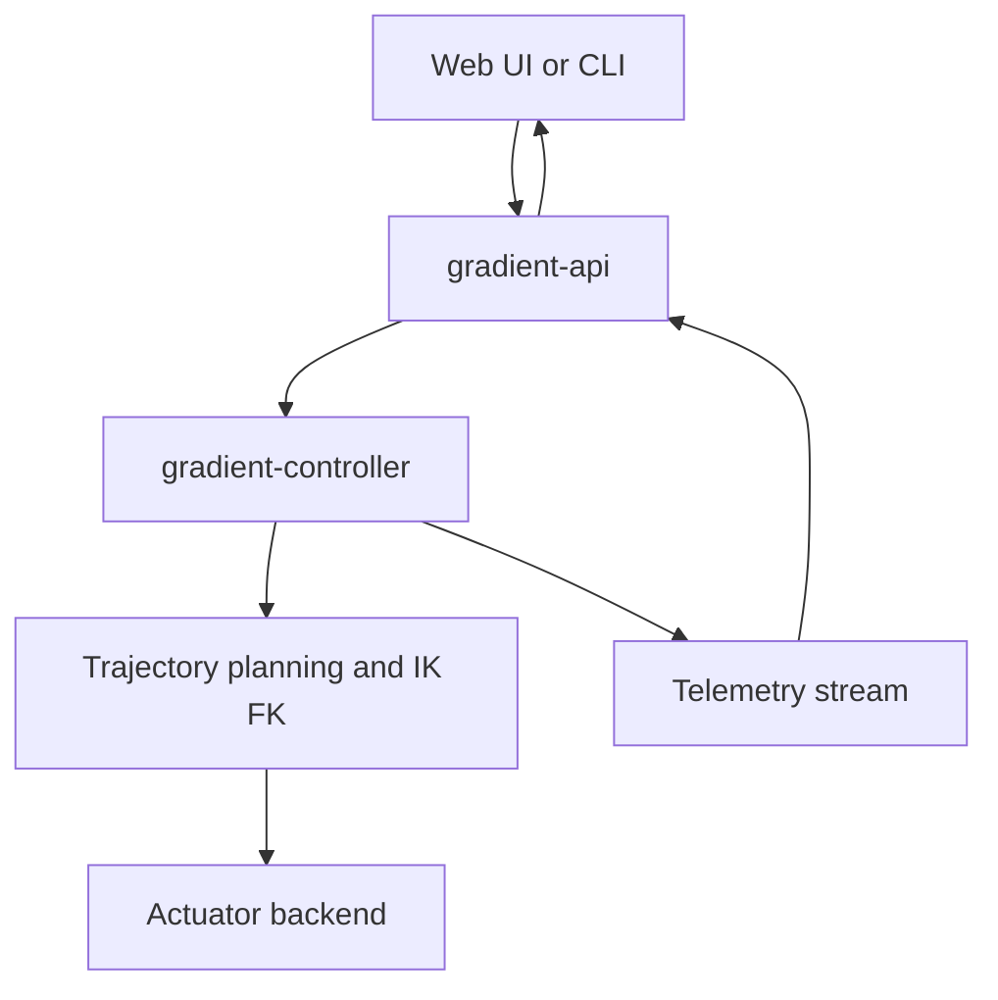
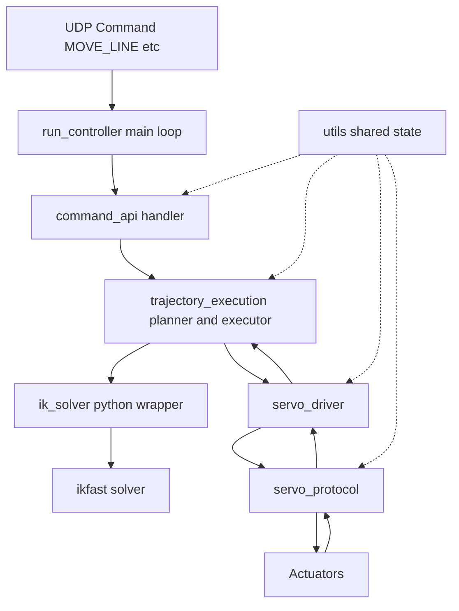
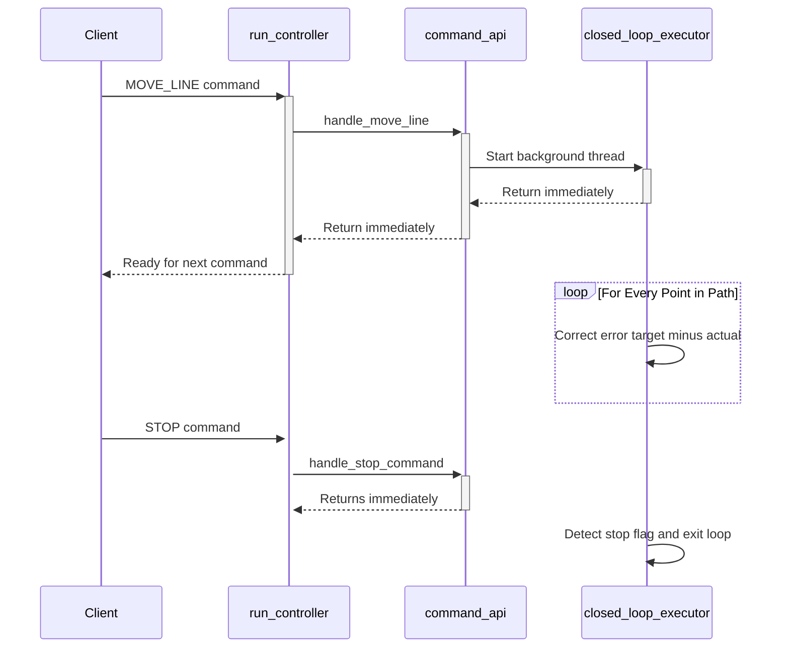

# GradientOS Documentation

GradientOS is a robot control and offline programming stack for Gradient Robotics arms.
It combines a realtime controller, an HTTP/SSE API, and a web operator interface for
trajectory and weld workflows.

This file is the starting point for new contributors and operators.

## What GradientOS Provides

- Realtime arm control through controller command handlers
- Cartesian and joint trajectory planning/execution
- STEP-based offline programming workflow with topology-aware weld planning
- Web UI with 3D scene visualization, telemetry, and program inspection
- Program Tree tooling to inspect exact execution path samples and edit control points
- Global Tool Library for end-effector definitions (offsets + optional meshes)
- Controller-owned hot runtime switching between `LIVE` and `SIM`
- Optional vision pipeline for camera streaming and image/AI processing

## How The System Works

### Runtime Components

- `gradient-controller`
  - UDP command server and motion execution runtime
  - owns planning/execution primitives and actuator IO
- `gradient-api`
  - FastAPI proxy over controller commands
  - provides REST endpoints and `/monitor` SSE telemetry
- `web-ui`
  - React/TypeScript operator UI for planning, inspection, and execution
- `gradient-vision` (optional)
  - vision and MJPEG streaming utilities

### Data Flow


```mermaid
flowchart TD
    A[Web UI or CLI] --> B[gradient-api]
    B --> C[gradient-controller]
    C --> D[Trajectory planning and IK FK]
    D --> E[Actuator backend]
    C --> F[Telemetry stream]
    F --> B
    B --> A
```

## Quick Start

## Prerequisites

- Python 3.11+ (3.12 preferred)
- `uv` (recommended for env/package management)
- Node.js 18+ and npm (for `web-ui`)

## Setup

```bash
git clone https://github.com/terrorproforma/GradientOS.git --verbose
cd GradientOS
./setup.sh
```

Manual fallback:

```bash
uv venv .venv
source ./start.sh
```

## Run The Stack

Preferred local launcher:

```bash
# Full staged startup with combined log streaming
./start-stack.sh

# Controller + API only
./start-stack.sh --headless

# Inspect the current launcher/process state
./start-stack.sh status

# Probe physical hardware / RTCore state
./start-stack.sh probe

# Soft-stop a stack started by start-stack.sh
./start-stack.sh stop

# Hard-stop including RTCore + EtherCAT master
./start-stack.sh stop --hard
```

`start-stack.sh` sources `./start.sh`, then stages startup as controller -> API -> web UI.
Each run writes durable logs under `logs/startups/<timestamp>/` and updates
`logs/startups/latest/` to point at the newest run, while still streaming live logs in the
terminal. Startup does not advance past the controller stage until the RTCore metrics report
the full bus online and operational for all configured axes.

When started from an interactive terminal, the launcher switches into a small in-terminal
command console after startup completes. This is a line-oriented prompt in the style of
`scripts/rtcore_jog.py`: service logs continue streaming, and the current input line is
redrawn so the prompt does not get lost in the telemetry stream. Supported commands are
`stop`, `stop --hard`, `probe`, `status`, `help`, and `clear`.

`./start-stack.sh stop` is now the normal operator stop: it requests an explicit controller
power-down/de-energize, waits for the hardware to reach `BUS_UP_DISARMED`, then stops the
controller/API/web processes while leaving RTCore + EtherCAT alive so the drives stay on a
clean synchronized bus instead of faulting on sync loss. Use `./start-stack.sh stop --hard`
only when you truly want RTCore and `ethercat.service` torn down as well.

`./start-stack.sh probe` is the hardware-focused view. It reads RTCore metrics directly and
reports whether the physical system looks `ACTIVE`, `BUS_UP_DISARMED`, `FAULTED`, or
`INACTIVE`, along with per-axis DS402 state, statusword, error code, and slave AL state.

### Linux/macOS

```bash
# Controller (hardware)
./run.sh

# Or simulator controller
./run-sim.sh

# API
./run-api.sh

# Web UI
./run-web.sh
```

The Python launchers (`run.sh`, `run-sim.sh`, `run-api.sh`) bootstrap the repo environment
before process startup. If no repo env is active, they first apply `start.sh` semantics.

### Windows PowerShell

```powershell
# Terminal 1: simulator controller
.\run-sim.ps1

# Terminal 2: API
.\run-api.ps1

# Terminal 3: web UI
cd .\web-ui
npm install
npm run dev -- --host 0.0.0.0 --port 8000
```

PowerShell launchers activate the repo environment (`.venv\Scripts\Activate.ps1`) before
running controller/API modules.

Defaults:

- Web UI: `http://localhost:8000`
- API: `http://localhost:4400` (override with `GRADIENT_API_PORT`; moved from the historic `4000` because Windows `iphlpsvc` dynamically grabs `4000` and breaks Cursor Remote-SSH port forwarding)

## Capture Runtime Diagnostics

When the UI looks stuck or only partially loads, capture a host/runtime snapshot before
rebooting if possible. The snapshot is designed to answer the fast questions:

- Is the web server actually up?
- Is the controller still responding on UDP?
- Is the Pi under memory or swap pressure?
- Did the kernel recently log OOM, throttling, or GPU-related warnings?
- Which browser/web/controller processes were resident at the time?

Shell capture:

```bash
python -m gradient_os.diagnostics.runtime_snapshot
```

This writes a JSON artifact under `logs/diagnostics/<timestamp>-runtime.json`.

If the API is still reachable, you can also fetch the same class of snapshot over HTTP:

```bash
curl http://127.0.0.1:4400/debug/runtime
```

The payload includes host memory/swap/load, Pi temperature + throttling flags when available,
interesting process snapshots, local web/controller probes, recent kernel hints, and the tail of
the latest `api.log`, `web.log`, and `controller.log`.

## First-Run Operator Workflow (Web UI)

1. Open the UI and set API host if needed.
2. Click **Connect** to subscribe to telemetry.
3. Load/import a STEP model for topology extraction.
4. Select edges, configure weld options, and plan preview.
5. Inspect execution details in Program Tree.
6. Use the header `LIVE` / `SIM` toggle if you need to hot-switch runtime mode before execution.
7. Select desired active tool in Settings > Tool Library (if needed) and apply runtime config.
8. Run preview trajectory/weld program.
9. Save/load weld programs as needed.

## Key Motion And Weld Behavior

- Weld preview execution uses high-fidelity planned steps.
- Program Tree reflects exact execution path samples (no intentionally coarse display path).
- `return_to_start` for weld runs resolves from the run-time pre-weld start pose.
- Realtime jog and trajectory playback include runtime guards to avoid controller contention.
- Weld work/travel angles are interpreted as torch-target angles and compensated by the active tool definition.
- `LIVE` / `SIM` switching is controller-owned and hot-applied; the API and UI are thin wrappers around that controller command.

Tool library storage is folder-based so definitions are drop-in discoverable:

- `tools/library/<tool_id>/tool.json`
- `tools/library/<tool_id>/*.stl` (or `.glb`/`.gltf`) for local mesh assets
- `tools/library/library.json` for library metadata (default tool, update metadata)
- In each `tool.json`, `offset.*` defines TCP/tool-tip transform, while optional `mesh.position_mm` + `mesh.rotation_deg` define visual mesh placement relative to the J6/flange anchor frame.

## CLI And Service Entry Points

After install, common commands include:

- `gradient-controller`
- `gradient-api`
- `gradient-ui`
- `gradient-cli`
- `gradient-vision`

If scripts are not on PATH, run through modules:

- `python -m gradient_os.run_controller`
- `python -m gradient_os.api.main`
- `python -m gradient_os.ui_start`
- `python -m gradient_os.cli_controller`
- `python -m gradient_os.vision`

## Project Layout

- `robots/` - canonical robot asset catalog (`robots/<robot_id>/robot.json`, URDF, DH CSV, model-local files)
- `src/gradient_os/arm_controller/` - controller runtime and command handlers
- `src/gradient_os/api/` - HTTP/SSE API
- `src/gradient_os/cad/` - topology extraction and STEP-driven planning helpers
- `src/gradient_os/vision/` - vision pipeline
- `web-ui/` - React operator interface
- `docs/` - subsystem docs and references
- `tests/` - automated tests

## Robot Asset Catalog

Robot geometry/kinematics files are resolved from `robots/<robot_id>/robot.json` with no
legacy path fallback. The controller selects runtime behavior via `--robot` (e.g. `gradient0`),
and each robot config exposes a stable `robot_id` that points to the matching asset bundle.

The Web UI syncs assets from this catalog with:

```bash
cd web-ui
npm run sync:assets
```

`npm run dev` and `npm run build` run this sync step automatically via npm pre-scripts.
`sync:assets` includes both robot and tool asset sync.

## Documentation Map

Core:

- `docs/run_controller.md`
- `docs/command_api.md`
- `docs/trajectory_execution.md`
- `docs/servo_driver.md`
- `docs/servo_protocol.md`
- `docs/utils.md`
- `docs/ik_solver.md`
- `docs/trajectory_recorder.md`

UI and API:

- `docs/UI_readme.md`
- `web-ui/README.md`

Vision:

- `src/gradient_os/vision/README.md`

EtherCAT/RTOS:

- `docs/ethercat/bringup.md`
- `docs/ethercat/igh.md`
- `docs/ethercat/rtcore_jog.md`

## Deployment Notes

For unattended deployments on Linux targets, see:

- `systemd/README.md`
- `web-ui/systemd/` (API service helper scripts)

## Troubleshooting Quick Checks

- UI cannot connect:
  - verify API is running on expected host/port
  - verify firewall/network path
- API is up but no motion:
  - verify controller process is running
  - verify controller host/port env configuration
- Unexpected motion behavior:
  - stop active jog mode before test execution
  - clear and re-plan preview before rerun

# Mini Arm Controller Documentation

This documentation provides a comprehensive overview of the Mini Arm Controller software, from the high-level API down to the low-level hardware communication and IK solver implementation.

## Installation 

```bash
git clone https://github.com/terrorproforma/GradientOS.git --verbose
cd GradientOS

# Preferred: automated setup (system deps + uv env + project install)
./setup.sh

# Manual fallback (custom envs / troubleshooting):
#   uv venv .venv
#   source ./start.sh   # activates venv, adjusts PYTHONPATH, adds aliases only if needed
```

The package provides command-line tools (available after install):
```bash
gradient-controller   # Main controller for UDP commands
gradient-ui           # Graphical user interface
gradient-cli          # Command-line interface
gradient-vision       # Vision module CLI (cameras, processing, streaming)
gradient-api          # FastAPI proxy that exposes REST/SSE telemetry
```

Component extras:
- Core (`gradient-controller`, `gradient-api`) are installed by default.
- CAD STEP topology extraction requires the `cad` extra: `uv pip install -e .[cad]`.
  - This installs `cadquery-ocp`, which provides the `OCP` module used for STEP topology parsing.
- UI/CLI tooling requires the `ui` extra: `uv pip install -e .[ui]`.
- Camera/vision tooling (including telemetry capture) lives behind the `vision` extra: `uv pip install -e .[vision]`.
- Raspberry Pi CSI cameras need the separate `picamera` extra: `uv pip install -e .[picamera]`.
- Combine extras as needed, e.g. `uv pip install -e .[cad,ui,vision,ai]` for full tooling.
- Raspberry Pi camera support still needs the system `picamera2` stack (typically installed via `sudo apt install -y python3-libcamera python3-picamera2`).

Notes:
- If you prefer not to install console scripts yet, aliases are provided after activation:
  - gradient-vision → python -m gradient_os.vision
  - gradient-ui → python -m gradient_os.ui_start
  - gradient-controller → python -m gradient_os.run_controller
  - gradient-cli → python -m gradient_os.cli_controller
- Always activate with `source ./start.sh`. Executing the script will not persist the environment.

`gradient-ui` can be run remotely and can connect to your pi or other board via UDP. `gradient-controller` must run locally on your pi or board connected to the motor controller. The HTTP proxy (`gradient-api`) fans out telemetry over Server-Sent Events and is typically co-hosted with the controller.

## HTTP API & Web Monitor

- Start the proxy manually once the environment is prepared:
  ```bash
  gradient-api --host 0.0.0.0 --port 4400
  ```
  With no `GRADIENT_API_CORS` set, the API allows requests from any origin. Override `GRADIENT_CONTROLLER_HOST`/`PORT` if the UDP controller runs elsewhere.
- A React-based telemetry dashboard lives under `web-ui/`. During development:
  ```bash
  cd web-ui
  npm install
  npm run dev -- --host 0.0.0.0 --port 8000
  ```
  Visiting `http://<pi-ip>:8000` auto-fills the API endpoint to `http://<pi-ip>:4400`; click **Connect** to subscribe to the `/monitor` SSE stream. The `/monitor` packet is the primary shared live-state feed for the UI and carries joints, gripper, alerts, drive-fault snapshots, connectivity metadata, and the normalized motion summary. Treat dedicated REST endpoints such as `/info/joints`, `/control/motion-status`, and `/debug/performance` as fallback or opt-in paths rather than the default high-rate live feed.
- For unattended setups, install the API as a systemd service using the helper scripts in `web-ui/systemd/` (mirrors the arm-controller tooling):
  ```bash
  cd web-ui/systemd
  ./install.sh
  # ./status.sh / ./restart.sh / ./stop.sh / ./uninstall.sh as needed
  ```
  The unit runs `gradient-api` from the repo virtualenv and binds to `0.0.0.0:4400` by default.

### Web jog controls (Control Panel)

- The floating control card rendered by `web-ui/src/ControlPanel.tsx` uses the same Cartesian jog buttons for both **incremental** and **realtime** jog, depending on whether realtime is started.
- With **realtime jog off** (default), each Cartesian button press issues a single incremental move whose step size is fully controlled by the numeric fields in the jog card:
- Translation buttons call `/control/move-line-relative` with a step of `Linear` millimeters (from the `Linear (mm/s)` input) along the selected axis, converted to meters in the payload. The request includes the current speed multiplier from the UI slider as `speed_multiplier`, and now defaults to `closed: false` so the controller uses the RTCore queued path on EtherCAT backends. Compatibility requests for `closed: true` no longer pull scheduled EtherCAT motion timing back into Python.
  - Orientation buttons call `/control/rotate` with a step of `Angular` degrees (from the `Angular (deg/s)` input) about the requested axis (`roll`, `pitch`, or `yaw`). The API forwards the relative `ROTATE` command directly, so the web UI now shares the controller's queued/open-loop orientation path and structured motion metadata instead of reconstructing a fresh absolute Euler target first.
- With **realtime jog on** (press the **Start** button in the Realtime Jog block), the same buttons switch to press-and-hold behavior and the UI uses the controller-owned session flow:
  - `POST /control/jog/session/start` on first hold
  - `POST /control/jog/session/update` while held with monotonically increasing `seq`
  - `POST /control/jog/session/stop` on release and page teardown
  The `Deadman` checkbox still gates whether any motion is commanded in this mode, and the `Linear` / `Angular` fields are interpreted as base linear and angular rates for the realtime vector.
- On EtherCAT RTCore, those streamed jog vectors are now converted into joint-velocity jog commands whose timed execution and stale-command timeout live in RTCore; simulation and Feetech still use the existing controller-owned realtime jog loop.
- Jog start/stop avoids re‑issuing servo commands when the jog vector is zero: the controller caches the last posture, skips IK work whenever both linear and angular rates are zero, and only sends new setpoints when an axis is actually pressed. This prevents the robot from creeping when operators simply toggle realtime on/off.


## Running as a systemd Service

For unattended deployments on Raspberry Pi, bundled systemd units live under
`systemd/`. See `systemd/README.md` for installation scripts and details for
both the controller (`systemd/controller/`) and the HTTP API proxy
(`systemd/api/`).


# command CLI 
The command-line interface, `gradient-cli`, for real-time control of the robot arm. The UI is built with the standard `curses` library for a lightweight, terminal-based experience.

Features include:
- Mode switching (Tab key) between Cartesian "pan" and tool "orient" control.
- Intuitive W/A/S/D and Shift key bindings for jogging the arm.
- Keys R/F open and close the gripper.
- Hotkeys (1, 2, 3) for sending the arm to preset Rest, Home, and Zero positions.
- A live display of the robot's current X/Y/Z position.

---

## Vision Module

For camera setup, streaming, and image processing, see the Vision README:
- Vision README: `src/gradient_os/vision/README.md`

Quick usage (after activation and install):
```bash
gradient-vision                  # Streams with Pi defaults (cam0, 1280x720@30)
gradient-vision list
gradient-vision init --camera 0 --width 640 --height 480 --fps 30
gradient-vision stream --camera 0 --width 640 --height 480 --fps 30 --duration 10
gradient-vision mjpeg         # HTTP server (auto-dual if 2 cams). Visit http://<host>:8080/
gradient-vision mjpeg img-proc --object-detection --color red --vflip --hflip
gradient-vision mjpeg ai --weights yolo11n.pt --conf 0.25 --imgsz 640 --device cpu --vflip --hflip
gradient-vision mjpeg ai-seg --weights yolo11n-seg.pt --conf 0.25 --imgsz 640 --device cpu
gradient-vision mjpeg ai-pose --weights yolo11n-pose.pt --conf 0.25 --imgsz 640 --device cpu
```

## System Overview and Data Flow

The Mini Arm Controller software is designed with a modular, layered architecture to separate concerns and improve maintainability. The system's primary responsibility is to accept high-level commands via UDP, translate them into low-level hardware instructions, and manage the real-time execution of complex motion paths.

### Data Flow Diagram

The following diagram illustrates how a command flows through the system, from the initial UDP packet to the final motor movement.


```mermaid
flowchart TD
    A[UDP Command MOVE_LINE etc] --> B[run_controller main loop]
    B --> C[command_api handler]
    C --> D[trajectory_execution planner and executor]
    D --> E[ik_solver python wrapper]
    E --> F[ikfast solver]
    D --> G[servo_driver]
    G --> H[servo_protocol]
    H --> I[Actuators]
    I --> H
    H --> G
    G --> D
    J[utils shared state] -.-> C
    J -.-> D
    J -.-> G
    J -.-> H
```

### Component Breakdown

1.  **User:** The user sends a command as a simple string over UDP (e.g., `"MOVE_LINE,0.3,0.1,0.2"`).

2.  **`run_controller.py`:** This is the main entry point of the application. Its `main()` function contains a simple, non-blocking loop that listens for UDP packets. When a packet is received, it is parsed and dispatched to the appropriate handler in the `command_api`.

3.  **`arm_controller` Package:** This is the core of the controller logic.
    *   **`command_api.py`:** Receives the dispatched command. It interprets the command's parameters and orchestrates the other modules to fulfill the request. For a `MOVE_LINE` command, it calls upon the `trajectory_execution` module.
    *   **`trajectory_execution.py`:** This module contains the most complex logic. It takes high-level goals (like "move from A to B in a straight line") and performs two key steps:
        1.  **Planning:** It calls the `ik_solver` to plan the entire path, converting the Cartesian trajectory into a dense series of joint angle solutions.
        2.  **Execution:** It starts a background thread (`_closed_loop_executor_thread`) to execute this path, using feedback from the servos to correct for errors in real time.
    *   **`ik_solver.py`:** This is a Python wrapper that provides a clean interface to the high-performance C++ IKFast solver.
    *   **`ikfast_solver` (C++):** The compiled IKFast library that can solve for the robot's joint angles for a given end-effector pose with extreme speed.
    *   **`servo_driver.py`:** Provides a hardware abstraction layer. It takes simple commands like "set these joint angles in radians" and translates them into the raw 0-4095 values the servos understand.
    *   **`servo_protocol.py`:** The lowest level of the software stack. It is responsible for constructing the exact byte-for-byte packets (including headers, IDs, and checksums) required by the Feetech servo communication protocol. It sends these packets over the serial port.
    *   **`utils.py`:** A shared module containing global state (like the current trajectory status) and configuration constants (like joint limits and servo IDs) that are needed by all other modules.

4.  **Servos:** The physical hardware receives the command packets and moves to the specified positions. The closed-loop control relies on the `sync_read` command to get position feedback from the servos, which flows back up the stack to the `trajectory_execution` module.

## C++ IKFast Implementation

The high performance of the system's motion planning is made possible by the C++ IKFast solver. This is not a generic numerical solver; it's a specialized, analytically-derived solver created specifically for this robot's unique geometry.

*   **IKFast:** The core of the solver is auto-generated by [OpenRAVE's IKFast tool](http://openrave.org/docs/latest_stable/openravepy/ikfast/). We provide our robot's `.urdf` file to IKFast, and it produces a C++ file containing the complex trigonometric equations that analytically solve for the joint angles. Because it's an analytic solution, it is extremely fast (on the order of microseconds) and can return all possible valid solutions.

*   **`ikfast_solver.cpp`:** This file contains the primary `IKFastSolver` C++ class. It `#include`s the auto-generated solver code and provides clean C++ methods (`solve_ik`, `compute_fk`, `solve_ik_path`) that our Python wrapper can bind to. The `solve_ik_path` method is particularly important, as it contains an optimized C++ loop for solving sequential points, which is much faster than iterating in Python.

*   **`ik_wrapper.cpp`:** This file uses the [pybind11](https://github.com/pybind/pybind11) library to create the Python bindings for our `IKFastSolver` class. It exposes the C++ methods so that they can be called directly from Python as if they were native Python functions. This is what allows `ik_solver.py` to call `IK_SOLVER.solve_ik_path(...)`.

*   **`CMakeLists.txt`:** This is the build script for the C++ module. It handles finding the `pybind11` and `Python.h` libraries and compiling the C++ source files into a single `.so` (shared object) file that Python can import as a native module.

## Non-Blocking Command Architecture

A critical feature of the controller is its non-blocking, responsive design. The main command loop must **never** be blocked by a long-running move, as this would prevent it from processing urgent commands, such as an emergency stop.

The following sequence diagram illustrates how a move is initiated in a background thread, leaving the main loop free to handle other commands.


```mermaid
sequenceDiagram
    participant Client
    participant MainLoop as run_controller
    participant CommandAPI as command_api
    participant ExecutorThread as closed_loop_executor

    Client->>+MainLoop: MOVE_LINE command
    MainLoop->>+CommandAPI: handle_move_line
    CommandAPI->>+ExecutorThread: Start background thread
    ExecutorThread-->>-CommandAPI: Return immediately
    CommandAPI-->>-MainLoop: Return immediately
    MainLoop-->>-Client: Ready for next command

    loop For Every Point in Path
        ExecutorThread->>ExecutorThread: Correct error target minus actual
    end

    Client->>+MainLoop: STOP command
    MainLoop->>+CommandAPI: handle_stop_command
    CommandAPI-->>-MainLoop: Returns immediately

    ExecutorThread->>ExecutorThread: Detect stop flag and exit loop
```

### How it Works

1.  When a `MOVE_LINE` command is received, the `handle_move_line` function in `command_api.py` starts the `_closed_loop_executor_thread`.
2.  Crucially, the handler returns **immediately** after starting the thread. It does not wait for the move to finish. This frees the `MainLoop` in `run_controller.py` to listen for the next command.
3.  The `ExecutorThread` runs independently in the background, managing the high-frequency (~50 Hz) loop of reading servo feedback, calculating error, and sending corrected position commands.
4.  If the user sends a `STOP` command, the `MainLoop` is available to receive it instantly. It calls `handle_stop_command`, which sets a global flag (`trajectory_state["should_stop"] = True`).
5.  On its very next cycle, the `ExecutorThread` checks this flag, sees that it is `True`, and cleanly exits its control loop, stopping the robot's motion.
6.  For situations where blocking behavior is desired (e.g., scripting a sequence of moves), the `WAIT_FOR_IDLE` command can be used. It now waits on the controller's composite motion-execution view rather than blindly `.join()`ing one thread, so RTCore-backed queued motion and controller-managed program flow are both considered before the script proceeds.
