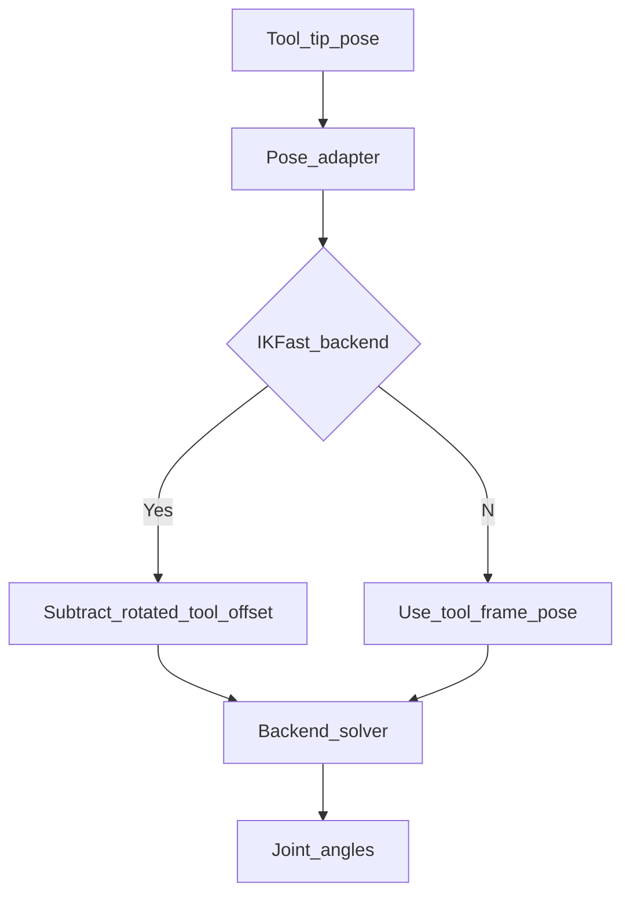

## `ik_solver.py` - Inverse Kinematics Python Wrapper

**Primary Responsibility:** To provide a high-level, solver-agnostic Python interface for IK/FK backends and enforce backend-correct pose semantics.

### File Description

This module acts as the bridge between Python control logic and active IK backends (IKFast and Numeric/QuIK). It exposes a stable API through functions like `solve_ik` and `get_fk` regardless of backend.

Its most important secondary responsibility is managing **backend-specific tool semantics**. IKFast expects wrist-frame targets (so tool offset must be subtracted), while QuIK accepts tool-frame targets directly (no subtraction in the IK call path).

---

### Core Concepts

#### End-Effector Offset

This is the most critical concept to understand when using the solver. Different backends expect different target frames:

- **IKFast backend**: solves wrist-frame targets; tool offset is rotated and subtracted.
- **Numeric (QuIK) backend**: solves tool-frame targets directly.

To command the tool tip to a specific `(x, y, z)` coordinate, `ik_solver.py` now routes through a backend-aware pose adapter so single-point and batch IK use identical semantics for the selected backend.

#### Closest Solution

Inverse Kinematics can often have multiple valid solutions for a given pose (e.g., "elbow up" vs. "elbow down"). To ensure smooth, predictable motion, this module's `_find_closest_solution` function takes the list of valid solutions from the C++ solver and compares it to the robot's current joint angles. It then selects the solution that requires the smallest overall change in joint angles, preventing unnecessary large movements.

### Key Functions

*   **`solve_ik(target_position, ...)`**: The primary inverse kinematics function. It takes a desired `target_position` for the **tool tip**, applies backend-aware target adaptation, and returns the best joint angle solution.

*   **`solve_ik_path_batch(path_points, ...)`**: A performance-critical function that takes a list of Cartesian points and solves for the entire path in a single backend call, using the same backend-aware pose adaptation used by `solve_ik`.

*   **`get_fk(active_joint_angles)` / `get_fk_matrix(...)`**: The forward kinematics functions. They take a set of joint angles and use the C++ solver to calculate the resulting Cartesian pose of the wrist. They then apply the `END_EFFECTOR_OFFSET` in the forward direction to return the final pose of the **tool tip**. 