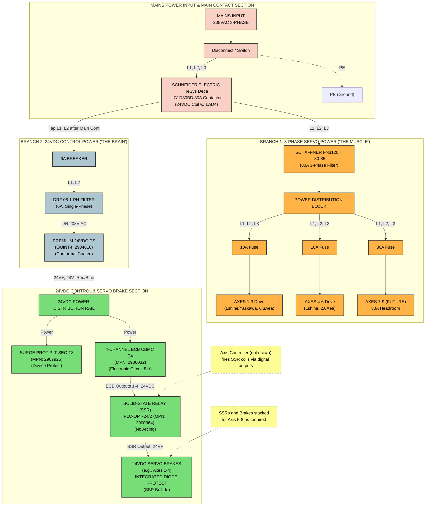

# Wiring Diagram

```mermaid
flowchart TD
    %% Main Power Section
    subgraph Mains ["MAINS POWER INPUT & MAIN CONTACT SECTION"]
        direction TB
        M["MAINS INPUT<br>208VAC 3-PHASE"] --> D["Disconnect / Switch"]
        D -->|L1, L2, L3| C["SCHNEIDER ELECTRIC TeSys Deca<br>LC1D80BD 80A Contactor<br>(24VDC Coil w/ LAD4)"]
        D -.->|PE| G["PE (Ground)"]
    end

    %% Branch 1
    subgraph Muscle ["BRANCH 1: 3-PHASE SERVO POWER ('THE MUSCLE')"]
        direction TB
        F1["SCHAFFNER FN3120H -80-35<br>(80A 3-Phase Filter)"] --> PDB["POWER DISTRIBUTION BLOCK"]
        
        PDB -->|L1, L2, L3| Fuse1["10A Fuse"]
        PDB -->|L1, L2, L3| Fuse2["10A Fuse"]
        PDB -->|L1, L2, L3| Fuse3["30A Fuse"]
        
        Fuse1 --> A1["AXES 1-3 Drive<br>(Lshine/Yaskawa, 6.3Aea)"]
        Fuse2 --> A2["AXES 4-6 Drive<br>(Lshine, 2.6Aea)"]
        Fuse3 --> A3["AXES 7-9 (FUTURE)<br>30A Headroom"]
    end
    
    C -->|L1, L2, L3| F1

    %% Branch 2
    subgraph Brain ["BRANCH 2: 24VDC CONTROL POWER ('THE BRAIN')"]
        direction TB
        B1["6A BREAKER"] -->|L1, L2| F2["DRF 06 1-PH FILTER<br>(6A, Single-Phase)"]
        F2 -->|L/N 208V AC| PS["PREMIUM 24VDC PS<br>(QUINT4, 2904616)<br>(Conformal Coated)"]
    end
    
    C -->|Tap L1, L2 after Main Cont| B1

    %% 24VDC Section
    subgraph ControlBrake ["24VDC CONTROL & SERVO BRAKE SECTION"]
        direction TB
        Rail["24VDC POWER DISTRIBUTION RAIL"]
        Rail -->|Power| SP["SURGE PROT PLT-SEC-T3<br>(MPN: 2907925)<br>(Device Protect)"]
        Rail -->|Power| ECB["4-CHANNEL ECB CBMC E4<br>(MPN: 2906032)<br>(Electronic Circuit Bkr)"]
        
        ECB -->|ECB Outputs 1-4, 24VDC| SSR["SOLID-STATE RELAY (SSR)<br>PLC-OPT-24/2 (MPN: 2900364)<br>(No Arcing)"]
        SSR -->|SSR Output, 24V+| Brakes["24VDC SERVO BRAKES<br>(e.g., Axes 1-4)<br>INTEGRATED DIODE PROTECT<br>(SSR Built-In)"]
    end
    
    PS -->|24V+, 24V- Red/Blue| Rail

    %% Notes outside
    Controller["Axis Controller (not drawn)<br>fires SSR coils via digital outputs"] -.-> SSR
    Note["SSRs and Brakes stacked<br>for Axis 5-8 as required"] -.-> Brakes

    %% Styling
    classDef power fill:#f9d0c4,stroke:#333,stroke-width:2px,color:#000;
    classDef servo fill:#ffb347,stroke:#333,stroke-width:2px,color:#000;
    classDef control fill:#aec6cf,stroke:#333,stroke-width:2px,color:#000;
    classDef brake fill:#77dd77,stroke:#333,stroke-width:2px,color:#000;
    classDef notes fill:#fdfd96,stroke:#333,stroke-width:1px,color:#000,stroke-dasharray: 5 5;
    
    class M,D,C power;
    class F1,PDB,Fuse1,Fuse2,Fuse3,A1,A2,A3 servo;
    class B1,F2,PS control;
    class Rail,SP,ECB,SSR,Brakes brake;
    class Controller,Note notes;
```
