## `servo_driver.py` - High-Level Servo Control

**Primary Responsibility:** To provide a clean, high-level interface for controlling the robot's servos, acting as a hardware abstraction layer.

### File Description

This module is responsible for translating intuitive, physical units (like joint angles in radians) into the raw, hardware-specific values required by the Feetech servos (0-4095). It abstracts away the details of gear ratios, servo orientation, and low-level communication, allowing the rest of the application to work in a more straightforward, physics-based manner.

It uses the `servo_protocol.py` module to handle the actual sending of command packets.

---

### Key Functions and Logic

#### Initialization

*   **`initialize_servos()`**: This function is called once at startup. It opens the serial port connection to the servos and then calls `set_servo_pid_gains` to ensure all servos are configured with the default PID values defined in `utils.py`.
*   **`set_servo_angle_limits_from_urdf()`**: Also called at startup, this function reads the URDF-defined joint limits and writes them permanently to each servo's EEPROM. This is a crucial safety feature that prevents the robot from physically damaging itself, even if incorrect commands are sent.

#### Core Control

*   **`set_servo_positions(...)`**: This is a key function in the control stack. It takes a list of six *logical* joint angles in radians and performs the necessary translations to command the nine *physical* servos. This includes:
    1.  Applying master calibration offsets from `utils.py`.
    2.  Applying the 1:2 gear ratio for the first logical joint.
    3.  Converting the final physical angle in radians into a raw servo value from 0-4095. This process correctly handles servos that are mounted in an inverted orientation.
    4.  Bundling all the commands and sending them to the `servo_protocol.sync_write_goal_pos_speed_accel` function for efficient, simultaneous execution.

*   **`get_current_arm_state_rad()`**: The inverse of `set_servo_positions`. It uses the efficient `sync_read_positions` command to get feedback from all physical servos in a single transaction. It then converts the raw values back into a list of the six logical joint angles in radians. This is the primary function for getting the state of the arm.

#### Unit Conversion

*   **`servo_value_to_radians(...)`**: This utility function contains the core logic for converting a raw servo position (0-4095) into a physical angle in radians. It normalizes the value to a 0-1 range, accounts for whether the servo is mapped directly or inverted (`_is_servo_direct_mapping`), and then scales the result to the appropriate radian range for that joint.

#### Hardware Configuration

*   **`set_servo_pid_gains(...)`**: Writes the Kp, Ki, and Kd gain values to the specified servo's EEPROM.
*   **`set_current_position_as_hardware_zero(...)`**: A powerful calibration function that sets the servo's current physical position as its new permanent hardware zero point. This is the recommended way to calibrate the arm's zero position without any mechanical adjustments.

---
## Calibration Logic Flow

The integrity of the calibration system relies on a closed-loop process where a value is written to a servo during calibration and is then read back and used for every subsequent motion and feedback calculation. The following diagram illustrates this flow:

```mermaid
graph TD
    subgraph "1. Calibration"
        A["User sends 'SET_ZERO' command"] --> B{"`set_current_position_as_hardware_zero()`"};
        B -- "Sends special command (128 to 0x28)" --> C(Servo Hardware);
        C -- "Servo calculates offset<br/>and saves it to its internal<br/>EEPROM at address <b>0x1F</b>" --> C;
    end

    subgraph "2. Motion"
        D["User sends any MOVE command"] --> E{"`set_servo_positions()`"};
        E --> F{"`get_servo_hardware_zero_offsets()`"};
        F -- "Sends READ command to address <b>0x1F</b>" --> G(Servo Hardware);
        G -- "Returns stored offset" --> F;
        F -- "Returns list of offsets" --> E;
        E -- "Calculates final command:<br/>Ideal Position + Offset" --> H(Servo Hardware);
    end

    subgraph "3. Feedback"
        I["User sends 'GET_POSITION'"] --> J{"`get_current_arm_state_rad()`"};
        J --> K{"`get_servo_hardware_zero_offsets()`"};
        K -- "Reads offset from <b>0x1F</b>" --> L(Servo Hardware);
        L -- "Returns stored offset" --> K;
        J -- "Reads current raw position" --> L;
        L -- "Returns raw position" --> J;
        J -- "Calculates final angle from:<br/>Raw Position - Offset" --> I;
    end

    style C fill:#f9f,stroke:#333,stroke-width:2px
    style G fill:#f9f,stroke:#333,stroke-width:2px
    style L fill:#f9f,stroke:#333,stroke-width:2px
    style H fill:#f9f,stroke:#333,stroke-width:2px
```

1.  **Calibration (`SET_ZERO`):** When this command is issued, `set_current_position_as_hardware_zero()` sends a special command to the servo. The servo's internal firmware then calculates the difference between its current position and its theoretical center and stores this difference permanently in its `Position Correction` register (address `0x1F`).

2.  **Motion (`set_servo_positions`):** Before every move, this function first calls `get_servo_hardware_zero_offsets()`, which reads the value directly from each servo's `Position Correction` register. It then adds this unique, calibrated offset to the ideal calculated position before sending the final command to the servo.

3.  **Feedback (`get_current_arm_state_rad`):** To provide an accurate reading of the arm's state, the feedback logic performs the perfect inverse of the motion logic. It reads the servo's current raw position and *also* reads its stored offset from the `Position Correction` register. It then **subtracts** the offset from the raw position before converting the result into a logical joint angle.

This symmetrical "add-on-write, subtract-on-read" process ensures that the robot's commanded position and its reported position are always consistent with the calibrated zero point. 

### The Calibration Process (SET_ZERO)
When you issue a `SET_ZERO` command, the following happens for each specified servo:
*   **Special Command:** The `set_current_position_as_hardware_zero` function sends a special, manufacturer-provided command to the servo (writing value `128` to register `0x28`).
*   **Internal Calculation:** The servo's own firmware receives this command. It measures its current position and calculates the precise offset needed to make that current position its new "center" (the `2048` raw value).
*   **Permanent Storage:** The servo saves this calculated offset to a special, permanent (EEPROM) memory location inside the servo itself: the `Position Correction` register (`0x1F`). This value persists even when the power is turned off.

### The Offset-Reading Process (get...offsets)
The `get_servo_hardware_zero_offsets` function is the direct counterpart to the `SET_ZERO` command. Its only job is to:
*   **Direct Read:** Send a standard `READ` instruction to each servo.
*   **Fetch Value:** Specifically request the signed, 2-byte value stored in the `Position Correction` register (`0x1F`)—the exact same location where `SET_ZERO` stored the offset.

### The Motion Process (set_servo_positions)
This is where the loop is closed. Before every single move, the `set_servo_positions` function:
*   **Calls `get_servo_hardware_zero_offsets()`:** It gets the fresh, calibrated offset values for every servo on the bus.
*   **Applies the Offset:** As we fixed earlier, it calculates the ideal raw position for a move and then adds the unique hardware offset for that specific servo before sending the final command. 